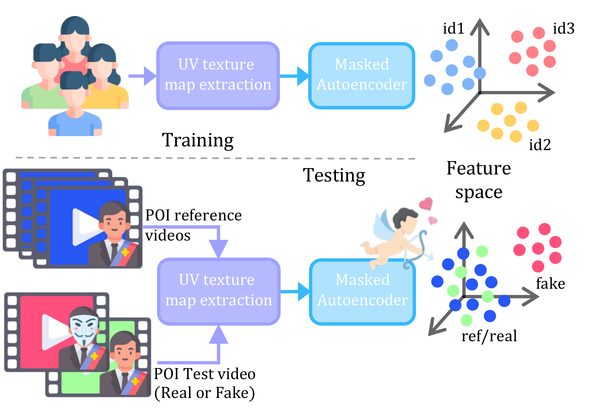
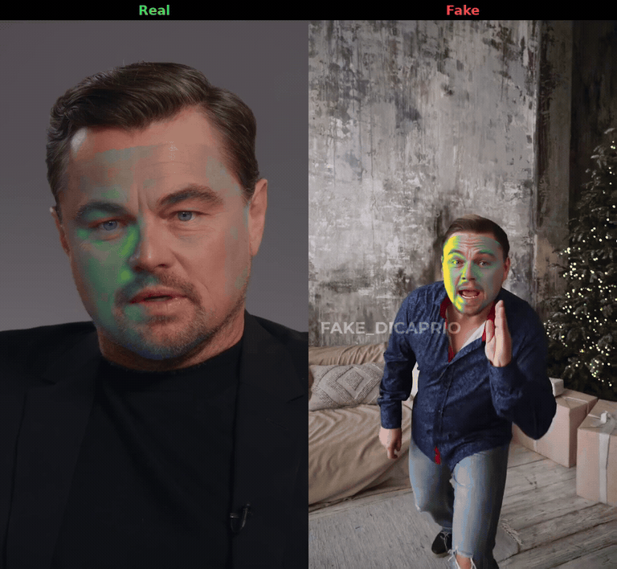
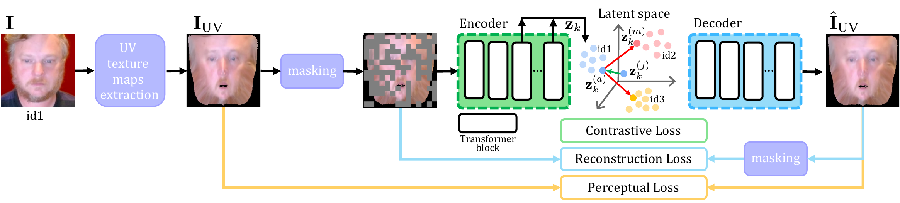

# CUPID: Reconstructing UV Texture Maps for Interpretable Person-of-Interest Deepfake Detection
by [Giovanni Affatato](mailto:giovanni.affatato@polimi.it), Sara Mandelli, Edoardo Daniele Cannas, Paolo Bestagini, and Stefano Tubaro.

This repository is the official implementation of [CUPID](https://arxiv.org/abs/2606.20302).

<p align="center">
  <a href="https://arxiv.org/abs/2606.20302"></a>
  <a href="https://huggingface.co/heyGio/CUPID"></a>
</p>

<p align="center"></p>

**Person-of-interest deepfake detection, inference.** CUPID learns a **general UV texture
representation of facial identity** from real videos of many subjects. Give it
genuine reference videos of a person and a test video: for an unseen
person of interest (POI), the same encoder builds a reference set from the
pristine videos, **without retraining**, and compares the test video against it
using the maximum cosine similarity across all reference/test frame-level CLS
embeddings. Higher similarity means more likely genuine.

## News
- 2026/09/11 - 🚀 Published inference code and model weights.

## Install

Requires **an NVIDIA GPU, Python ≥3.10, Git and FFmpeg shared libraries**.
There is no CPU fallback. Use a CUDA-enabled Python environment with a matching
**CUDA toolkit (`nvcc`) and C++ compiler** for the UV renderer. Install a compatible
[PyTorch/TorchCodec pair](https://github.com/pytorch/torchcodec#installing-torchcodec).

```bash
python -m pip install git+https://github.com/polimi-ispl/CUPID
```

The first run downloads weights and builds the CUDA extension; both are cached.

## Score your own video

```bash
cupid score --reference genuine1.mp4 genuine2.mp4 --test test.mp4
```

Use independent reference/test clips with **one clearly visible person**.
The score is not a probability or a calibrated real/fake decision. Choose a
threshold using separate validation data. By default, CUPID samples 15
equispaced frames per video.

For repeated use, save the reference set once:

```bash
cupid extract-reference --reference genuine1.mp4 genuine2.mp4 -o person.pt
cupid score --reference-set person.pt --test test.mp4
```

Or keep the model loaded in Python:

```python
from cupid.pipeline import CupidPipeline

pipeline = CupidPipeline()
reference = pipeline.extract_reference_set(["genuine1.mp4", "genuine2.mp4"])
score = pipeline.score(reference["features"], "test.mp4")
print(score)
```

## Interpretability maps

Add `--heatmap PATH` to save one **interpretability map** summarizing the sampled
frames of the test video. The PNG contains only the colored map in UV space,
without text, borders, or a color bar:

```bash
cupid score --reference genuine1.mp4 genuine2.mp4 --test test.mp4 --heatmap test.png
```

For repeated use, extract a reference set with interpretability support:

```bash
cupid extract-reference --reference genuine1.mp4 genuine2.mp4 --heatmap -o person.pt
cupid score --reference-set person.pt --test test.mp4 --heatmap test.png
```

Existing reference sets extracted without `--heatmap` still work for scoring;
re-extract them with this option to generate interpretability maps.

With the Python `pipeline` initialized above:

```python
reference = pipeline.extract_reference_set(
    ["genuine1.mp4", "genuine2.mp4"], include_tokens=True
)
result = pipeline.interpret(reference, "test.mp4")
print(result["score"])
interpretability_map = result["heatmap"]  # Unscaled UV-space values
```

The interpretability map highlights facial regions that deviate from the
subject's reference identity, accounting for variability among genuine
references. It is not a manipulation-probability map. Each PNG uses its own color
range, so brightness is not directly comparable across videos. See the
[paper](https://arxiv.org/abs/2606.20302) for further details.

## Try the DiCaprio demo

```bash
git clone https://github.com/polimi-ispl/CUPID.git
cd CUPID
python -m pip install -e '.[demo]'
cd demo
./download.sh && ./prepare_clips.sh && python quickstart.py
```

Downloads may need browser cookies; the default is Firefox. Use
`COOKIES_FROM_BROWSER=chrome ./download.sh` to select Chrome.
The demo also needs the FFmpeg executable with libx264 and DejaVu Sans fonts.
[Demo details](demo/README.md).

It scores all **3 genuine + 4 fake clips** and generates only the selected
**Real 2 / Fake 2** comparison: `scores.json`, `comparison.mp4`,
`comparison.gif`, and compact `metadata.json`, saved in **`demo/results/`**.
Intermediate files are temporary.

<p align="center">
  
</p>

**Recorded demo: AUC 1.000; genuine/fake margin +0.011314.** Eight reference
clips, 15 equispaced frames per video, native resolution. [All seven scores](docs/demo-results.json).
This small demonstration is not a generalization benchmark.

For the video overlay, we replace the paper's video-wide averaging with a
centered five-frame average of decoded UV maps. We then subtract the fixed
reference baseline, take the absolute value, and project the interpretability
map onto each frame's face. Both clips share one color range; the maps are not
manipulation probabilities.

## Method

<p align="center"></p>

Sampled frames are face-aligned, then a 3D morphable-model-based extractor maps
facial appearance into **canonical UV coordinates**, so corresponding pixels
describe the same facial region despite pose and expression changes. A
vision-transformer masked autoencoder is trained on genuine identities only,
with 50% of UV texture map patches masked. Its joint objective combines **masked
reconstruction**, **perceptual**, and **multi-layer contrastive** losses to learn
facial texture and identity-aware representations. Masking is disabled at
inference; the encoder supplies CLS embeddings and the decoder supports
interpretability maps.

<details>
<summary>Options and troubleshooting</summary>

- `--device cuda:1`: choose a GPU. Default: first CUDA GPU.
- `--frames N`: change the number of sampled frames.
- `--weights-dir DIR` or `CUPID_WEIGHTS_DIR`: use local weights instead of downloading.
- `cupid --help` / `cupid score --help`: available commands and options.

For CUDA build errors, check that `nvcc` matches the PyTorch CUDA version.
For decoder errors, check the PyTorch/TorchCodec pairing and that FFmpeg shared
libraries are discoverable. Dependency lower bounds are not an environment lock.

Known limitations: no-face scoring is not yet rejected, and `--json` output can
contain diagnostics. Use valid-face footage and the Python API for automation.

</details>

<details>
<summary>Weights and licenses</summary>

| Required local filename | Source / provenance |
| --- | --- |
| `cupid_mae.pth` | [CUPID](https://huggingface.co/heyGio/CUPID), MIT |
| `retinaface_resnet50_2020-07-20_old_torch.pth` | [RetinaFace](https://github.com/biubug6/Pytorch_Retinaface), MIT |
| `large_base_net.pth` | [HRN](https://github.com/youngLBW/HRN) |
| `net_recon.pth` | [3DDFA_V3](https://github.com/wang-zidu/3DDFA-V3), MIT |
| `face_model.npy` | [BFM](https://faces.dmi.unibas.ch/bfm/), Exp_Pca / [Deep3D](https://github.com/microsoft/Deep3DFaceReconstruction), separate terms |

The four third-party assets download from [3DDFA_V3's Hub repository](https://huggingface.co/datasets/Zidu-Wang/3DDFA-V3).
Only load trusted weights/reference files. CUPID code is [MIT](LICENSE);
vendored code retains its [3DDFA_V3 notice](cupid/tddfa_v3/LICENSE).
Third-party assets and DiCaprio footage/GIF retain their own rights and terms;
MIT does not grant their redistribution rights.

</details>

## Citation

```bibtex
@article{affatato2026cupid,
  title = {{CUPID}: Reconstructing {UV} Texture Maps for Interpretable Person-of-Interest Deepfake Detection},
  author = {Affatato, Giovanni and Mandelli, Sara and Cannas, Edoardo Daniele and Bestagini, Paolo and Tubaro, Stefano},
  journal = {arXiv preprint arXiv:2606.20302},
  year = {2026},
  url = {https://arxiv.org/abs/2606.20302}
}
```
